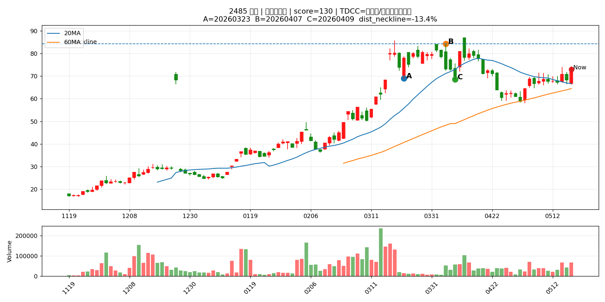
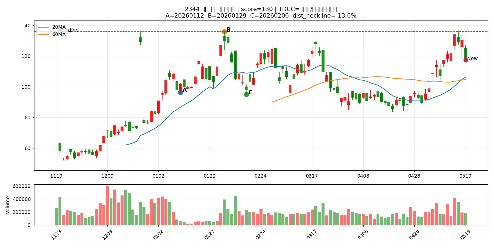
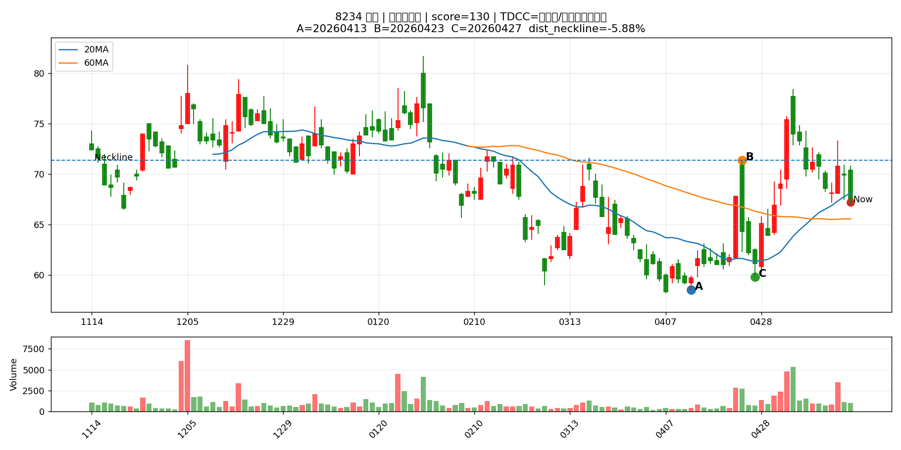
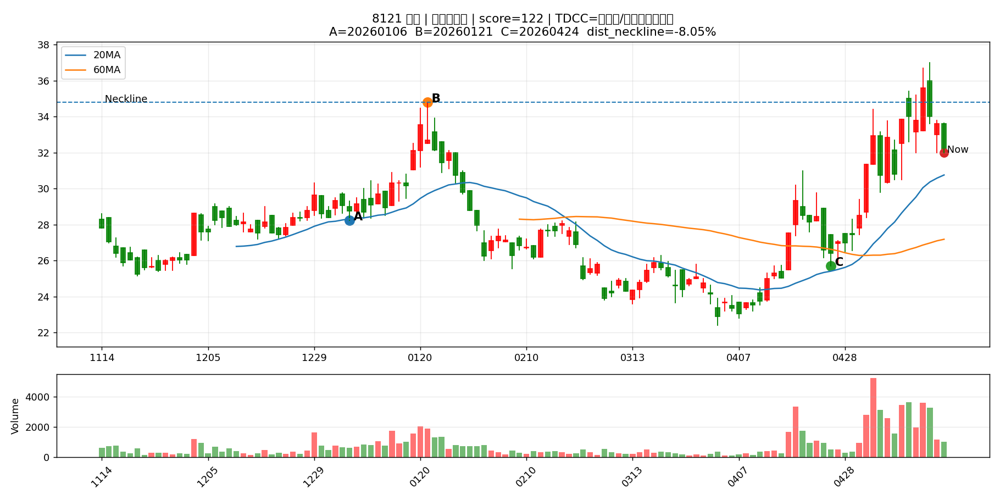
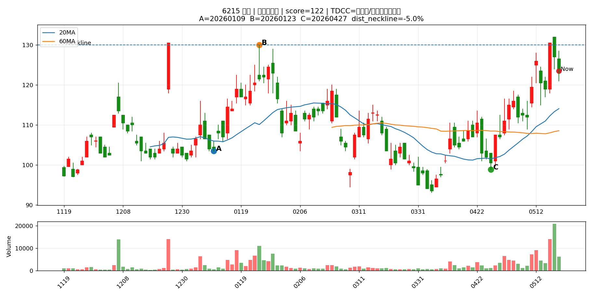
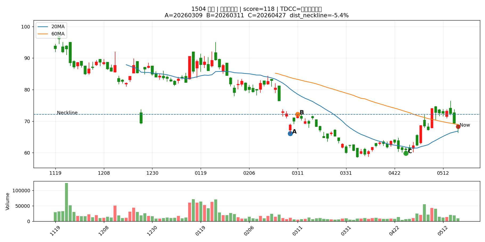
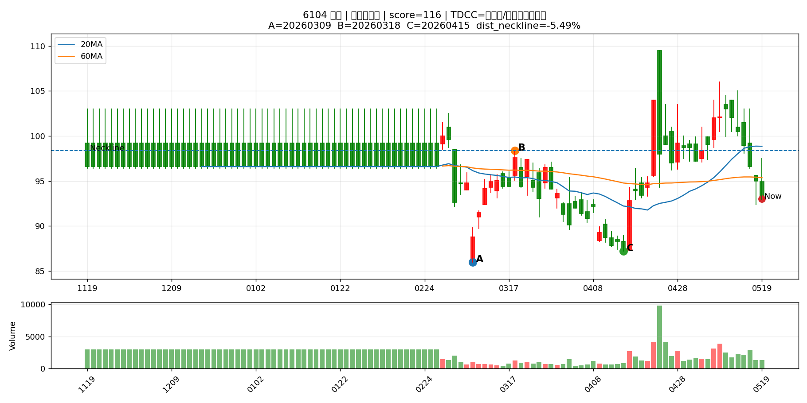
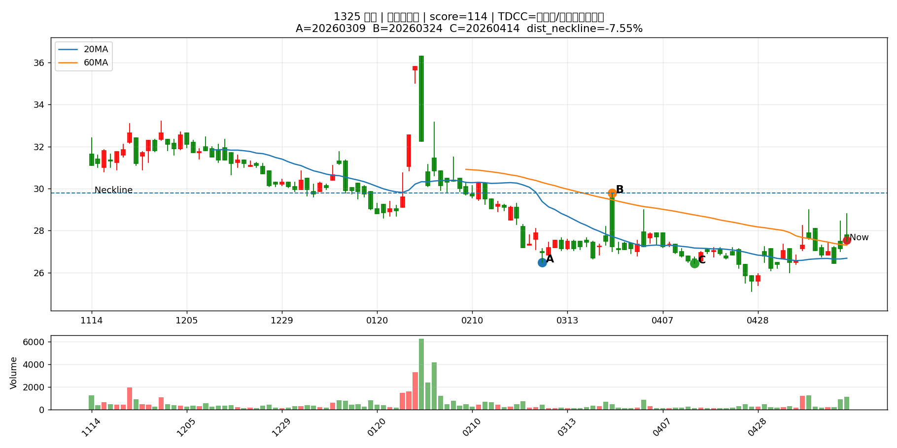

# Pattern Chart Report

產生時間：2026-05-19 17:58:31
圖表數量：30

> 這份報告把 Pattern Scan 前 30 檔畫成 K 線圖，讓你用人眼篩掉不符合型態的股票。

> 圖中標示 A=第一低點、B=頸線、C=第二低點、Now=最新收盤。

## 總覽圖

---

## 圖表索引

|   代號 | 名稱    | 產業       | 型態階段   |   型態分數 |   距頸線% |   距第二底% |   二攻量/一攻量 | TDCC判斷      | 圖表                                   |
|-----:|:------|:---------|:-------|-------:|-------:|--------:|----------:|:------------|:-------------------------------------|
| 1815 | 富喬    | 電子零組件業   | 預備發動型  |    130 | -12.82 |    7.37 |      3.52 | 大戶籌碼減少      | [查看圖](pattern_charts/1815_富喬.png)    |
| 2485 | 兆赫    | 通信網路業    | 預備發動型  |    130 | -14.12 |    5.69 |      2.95 | 中大戶/超大戶同步增加 | [查看圖](pattern_charts/2485_兆赫.png)    |
| 1304 | 台聚    | 塑膠工業     | 預備發動型  |    130 |  -6.54 |   10.96 |      2.54 | 中大戶/超大戶同步增加 | [查看圖](pattern_charts/1304_台聚.png)    |
| 2337 | 旺宏    | 半導體業     | 預備發動型  |    130 | -11.11 |   22.03 |      2.4  | 大戶籌碼減少      | [查看圖](pattern_charts/2337_旺宏.png)    |
| 1305 | 華夏    | 塑膠工業     | 預備發動型  |    130 |  -6.02 |   11.11 |      2.22 | 中大戶/超大戶同步增加 | [查看圖](pattern_charts/1305_華夏.png)    |
| 2344 | 華邦電   | 半導體業     | 預備發動型  |    130 | -13.6  |   23.68 |      1.93 | 中大戶/超大戶同步增加 | [查看圖](pattern_charts/2344_華邦電.png)   |
| 8234 | 新漢    | 電腦及週邊設備業 | 預備發動型  |    130 |  -5.88 |   12.37 |      1.81 | 中大戶/超大戶同步增加 | [查看圖](pattern_charts/8234_新漢.png)    |
| 4927 | 泰鼎-KY | 電子零組件業   | 預備發動型  |    130 |  -7.25 |   21.71 |      1.46 | 大戶籌碼減少      | [查看圖](pattern_charts/4927_泰鼎-KY.png) |
| 6282 | 康舒    | 電子零組件業   | 預備發動型  |    124 |  -7.64 |   19.53 |      1.41 | 中大戶/超大戶同步增加 | [查看圖](pattern_charts/6282_康舒.png)    |
| 3701 | 大眾控   | 電腦及週邊設備業 | 預備發動型  |    122 | -12.48 |    7.25 |      2.2  | 大戶籌碼減少      | [查看圖](pattern_charts/3701_大眾控.png)   |
| 8121 | 越峰    | 電子零組件業   | 預備發動型  |    122 |  -8.05 |   24.51 |      1.8  | 中大戶/超大戶同步增加 | [查看圖](pattern_charts/8121_越峰.png)    |
| 6215 | 和椿    | 其他電子業    | 預備發動型  |    122 |  -5    |   24.87 |      1.36 | 中大戶/超大戶同步增加 | [查看圖](pattern_charts/6215_和椿.png)    |
| 1905 | 華紙    | 造紙工業     | 預備發動型  |    118 | -10.57 |    3.95 |      3.17 | 大戶籌碼減少      | [查看圖](pattern_charts/1905_華紙.png)    |
| 1504 | 東元    | 電機機械     | 預備發動型  |    118 |  -5.96 |   13.36 |      2.66 | 大戶籌碼減少      | [查看圖](pattern_charts/1504_東元.png)    |
| 1447 | 力鵬    | 紡織纖維     | 預備發動型  |    118 |  -9.38 |   18.37 |      2.49 | 中大戶/超大戶同步增加 | [查看圖](pattern_charts/1447_力鵬.png)    |
| 2449 | 京元電子  | 半導體業     | 預備發動型  |    118 | -11.89 |   13.11 |      1.61 | 大戶籌碼減少      | [查看圖](pattern_charts/2449_京元電子.png)  |
| 3689 | 湧德    | 電子零組件業   | 預備發動型  |    118 |  -8.95 |    6.36 |      1.54 | 變化不明顯       | [查看圖](pattern_charts/3689_湧德.png)    |
| 6104 | 創惟    | 半導體業     | 預備發動型  |    116 |  -5.49 |    6.65 |      3.23 | 中大戶/超大戶同步增加 | [查看圖](pattern_charts/6104_創惟.png)    |
| 1313 | 聯成    | 塑膠工業     | 預備發動型  |    116 | -11.02 |    5    |      2.52 | 中大戶/超大戶同步增加 | [查看圖](pattern_charts/1313_聯成.png)    |
| 2419 | 仲琦    | 通信網路業    | 預備發動型  |    116 |  -8.23 |    9.26 |      2.45 | 中大戶/超大戶同步增加 | [查看圖](pattern_charts/2419_仲琦.png)    |
| 8111 | 立碁    | 光電業      | 預備發動型  |    116 | -11.76 |    6.03 |      1.9  | 大戶籌碼減少      | [查看圖](pattern_charts/8111_立碁.png)    |
| 6505 | 台塑化   | 油電燃氣業    | 預備發動型  |    116 |  -6.04 |    5.99 |      1.89 | 中大戶/超大戶同步增加 | [查看圖](pattern_charts/6505_台塑化.png)   |
| 2605 | 新興    | 航運業      | 預備發動型  |    116 |  -5.46 |    9.78 |      1.67 | 大戶籌碼減少      | [查看圖](pattern_charts/2605_新興.png)    |
| 2359 | 所羅門   | 其他電子業    | 預備發動型  |    116 |  -9.4  |   14.41 |      1.63 | 大戶籌碼減少      | [查看圖](pattern_charts/2359_所羅門.png)   |
| 5452 | 佶優    | 其他電子業    | 預備發動型  |    116 | -14.3  |    6.3  |      1.48 | 大戶籌碼減少      | [查看圖](pattern_charts/5452_佶優.png)    |
| 6451 | 訊芯-KY | 半導體業     | 預備發動型  |    114 | -12.95 |   14.42 |      1.93 | 中大戶/超大戶同步增加 | [查看圖](pattern_charts/6451_訊芯-KY.png) |
| 6548 | 長科*   | 半導體業     | 預備發動型  |    114 |  -6.01 |    7.54 |      1.76 | 大戶籌碼減少      | [查看圖](pattern_charts/6548_長科*.png)   |
| 1325 | 恆大    | 塑膠工業     | 預備發動型  |    114 |  -7.55 |    4.16 |      1.35 | 中大戶/超大戶同步增加 | [查看圖](pattern_charts/1325_恆大.png)    |
| 6962 | 奕力-KY | 半導體業     | 預備發動型  |    112 | -12.85 |    6.52 |      2.72 | 超大戶增加       | [查看圖](pattern_charts/6962_奕力-KY.png) |
| 2501 | 國建    | 建材營造     | 預備發動型  |    112 |  -6.53 |    4.47 |      2.27 | 大戶籌碼減少      | [查看圖](pattern_charts/2501_國建.png)    |

---

## 1815 富喬

## 2485 兆赫

## 1304 台聚

## 2337 旺宏

## 1305 華夏

## 2344 華邦電

## 8234 新漢

## 4927 泰鼎-KY

## 6282 康舒

## 3701 大眾控

## 8121 越峰

## 6215 和椿

## 1905 華紙

## 1504 東元

## 1447 力鵬

## 2449 京元電子

## 3689 湧德

## 6104 創惟

## 1313 聯成

## 2419 仲琦

## 8111 立碁

## 6505 台塑化

## 2605 新興

## 2359 所羅門

## 5452 佶優

## 6451 訊芯-KY

## 6548 長科*

## 1325 恆大

## 6962 奕力-KY

## 2501 國建

