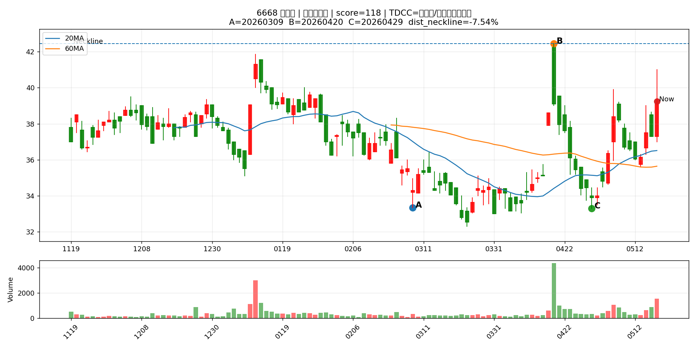
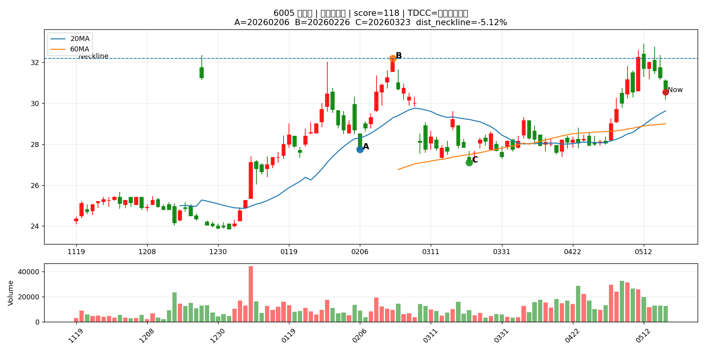
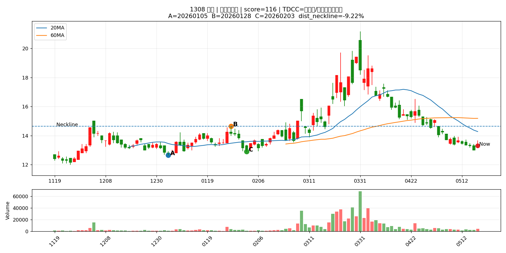
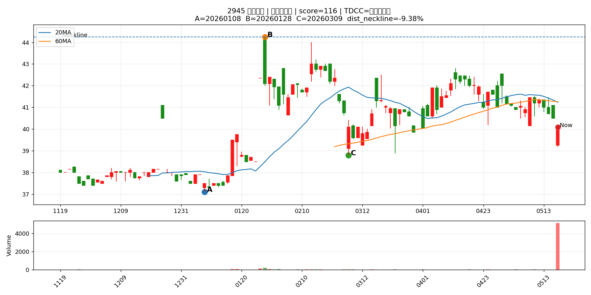
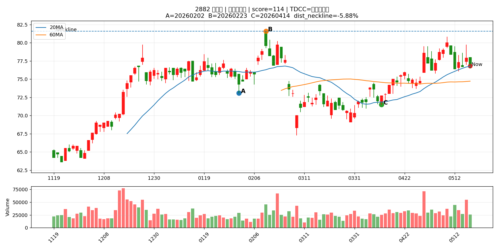
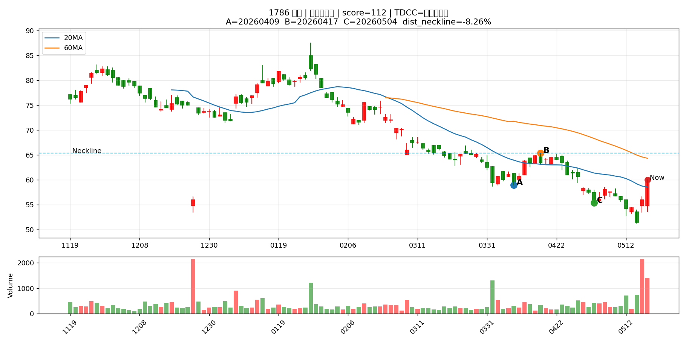
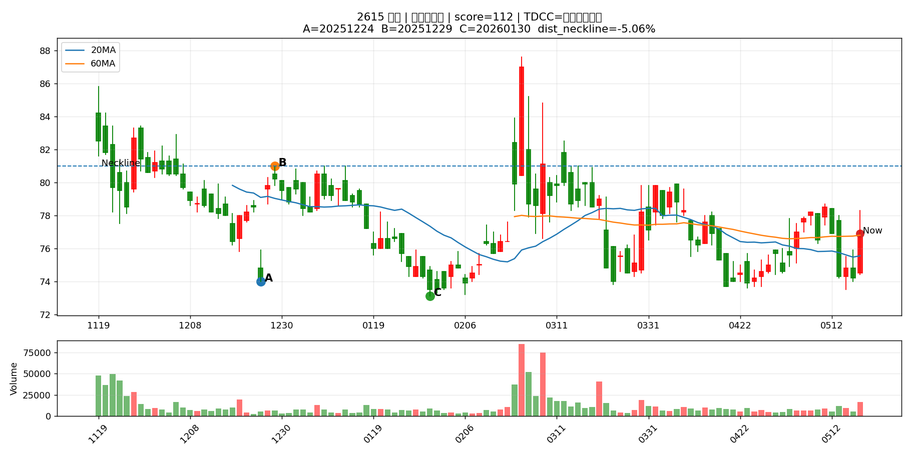
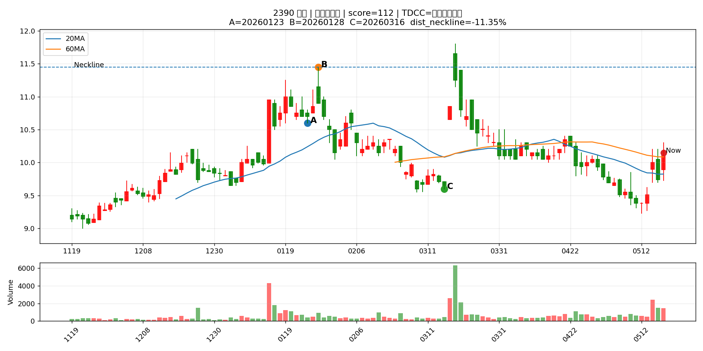

# Pattern Chart Report

產生時間：2026-05-18 18:09:13
圖表數量：30

> 這份報告把 Pattern Scan 前 30 檔畫成 K 線圖，讓你用人眼篩掉不符合型態的股票。

> 圖中標示 A=第一低點、B=頸線、C=第二低點、Now=最新收盤。

## 總覽圖

---

## 圖表索引

|   代號 | 名稱    | 產業       | 型態階段   |   型態分數 |   距頸線% |   距第二底% |   二攻量/一攻量 | TDCC判斷      | 圖表                                   |
|-----:|:------|:---------|:-------|-------:|-------:|--------:|----------:|:------------|:-------------------------------------|
| 4927 | 泰鼎-KY | 電子零組件業   | 預備發動型  |    136 | -10.87 |   19.13 |      1.96 | 大戶籌碼減少      | [查看圖](pattern_charts/4927_泰鼎-KY.png) |
| 2419 | 仲琦    | 通信網路業    | 預備發動型  |    130 | -12.28 |    4.9  |      2.87 | 中大戶/超大戶同步增加 | [查看圖](pattern_charts/2419_仲琦.png)    |
| 2485 | 兆赫    | 通信網路業    | 預備發動型  |    130 | -13.4  |    6.57 |      2.85 | 中大戶/超大戶同步增加 | [查看圖](pattern_charts/2485_兆赫.png)    |
| 6155 | 鈞寶    | 電子零組件業   | 預備發動型  |    130 |  -6.31 |   14.04 |      2.08 | 大戶籌碼減少      | [查看圖](pattern_charts/6155_鈞寶.png)    |
| 6282 | 康舒    | 電子零組件業   | 預備發動型  |    124 |  -7.64 |   19.53 |      1.48 | 中大戶/超大戶同步增加 | [查看圖](pattern_charts/6282_康舒.png)    |
| 3701 | 大眾控   | 電腦及週邊設備業 | 預備發動型  |    122 | -11.2  |    8.82 |      2.17 | 大戶籌碼減少      | [查看圖](pattern_charts/3701_大眾控.png)   |
| 5269 | 祥碩    | 半導體業     | 預備發動型  |    122 |  -6.08 |   21.93 |      1.19 | 大戶籌碼減少      | [查看圖](pattern_charts/5269_祥碩.png)    |
| 1905 | 華紙    | 造紙工業     | 預備發動型  |    118 |  -9.43 |    4.35 |      3.03 | 大戶籌碼減少      | [查看圖](pattern_charts/1905_華紙.png)    |
| 6962 | 奕力-KY | 半導體業     | 預備發動型  |    118 | -12    |    7.56 |      2.81 | 超大戶增加       | [查看圖](pattern_charts/6962_奕力-KY.png) |
| 1504 | 東元    | 電機機械     | 預備發動型  |    118 |  -5.4  |   14.02 |      2.78 | 大戶籌碼減少      | [查看圖](pattern_charts/1504_東元.png)    |
| 2449 | 京元電子  | 半導體業     | 預備發動型  |    118 | -10.06 |   15.46 |      1.56 | 大戶籌碼減少      | [查看圖](pattern_charts/2449_京元電子.png)  |
| 6668 | 中揚光   | 光電業      | 預備發動型  |    118 |  -7.54 |   17.87 |      1.53 | 中大戶/超大戶同步增加 | [查看圖](pattern_charts/6668_中揚光.png)   |
| 6005 | 群益證   | 金融保險業    | 預備發動型  |    118 |  -5.12 |   12.73 |      1.4  | 大戶籌碼減少      | [查看圖](pattern_charts/6005_群益證.png)   |
| 1308 | 亞聚    | 塑膠工業     | 預備發動型  |    116 |  -9.22 |    3.1  |      4.47 | 中大戶/超大戶同步增加 | [查看圖](pattern_charts/1308_亞聚.png)    |
| 2945 | 三商家購  | 貿易百貨     | 預備發動型  |    116 |  -9.38 |    3.35 |      2.84 | 變化不明顯       | [查看圖](pattern_charts/2945_三商家購.png)  |
| 1313 | 聯成    | 塑膠工業     | 預備發動型  |    116 | -11.44 |    4.5  |      2.69 | 中大戶/超大戶同步增加 | [查看圖](pattern_charts/1313_聯成.png)    |
| 6505 | 台塑化   | 油電燃氣業    | 預備發動型  |    116 |  -6.23 |    5.79 |      2.04 | 中大戶/超大戶同步增加 | [查看圖](pattern_charts/6505_台塑化.png)   |
| 3380 | 明泰    | 通信網路業    | 預備發動型  |    116 | -12.65 |    5.83 |      1.97 | 大戶籌碼減少      | [查看圖](pattern_charts/3380_明泰.png)    |
| 2605 | 新興    | 航運業      | 預備發動型  |    116 |  -6.55 |    8.51 |      1.88 | 大戶籌碼減少      | [查看圖](pattern_charts/2605_新興.png)    |
| 2413 | 環科    | 電子零組件業   | 預備發動型  |    116 |  -8.48 |   22.58 |      1.69 | 變化不明顯       | [查看圖](pattern_charts/2413_環科.png)    |
| 2241 | 艾姆勒   | 汽車工業     | 預備發動型  |    116 | -13.79 |   12.82 |      1.58 | 大戶籌碼減少      | [查看圖](pattern_charts/2241_艾姆勒.png)   |
| 2359 | 所羅門   | 其他電子業    | 預備發動型  |    116 |  -6.71 |   17.8  |      1.39 | 大戶籌碼減少      | [查看圖](pattern_charts/2359_所羅門.png)   |
| 6153 | 嘉聯益   | 電子零組件業   | 預備發動型  |    116 |  -6.74 |   20.98 |      1.29 | 大戶籌碼減少      | [查看圖](pattern_charts/6153_嘉聯益.png)   |
| 1447 | 力鵬    | 紡織纖維     | 預備發動型  |    116 | -10    |    7.66 |      1.21 | 中大戶/超大戶同步增加 | [查看圖](pattern_charts/1447_力鵬.png)    |
| 6451 | 訊芯-KY | 半導體業     | 預備發動型  |    114 |  -6.47 |   22.93 |      1.93 | 中大戶/超大戶同步增加 | [查看圖](pattern_charts/6451_訊芯-KY.png) |
| 2882 | 國泰金   | 金融保險業    | 預備發動型  |    114 |  -5.88 |    7.41 |      1.43 | 變化不明顯       | [查看圖](pattern_charts/2882_國泰金.png)   |
| 2501 | 國建    | 建材營造     | 預備發動型  |    112 |  -6.95 |    4    |      2.27 | 大戶籌碼減少      | [查看圖](pattern_charts/2501_國建.png)    |
| 1786 | 科妍    | 生技醫療業    | 預備發動型  |    112 |  -8.26 |    8.3  |      2.14 | 超大戶增加       | [查看圖](pattern_charts/1786_科妍.png)    |
| 2615 | 萬海    | 航運業      | 預備發動型  |    112 |  -5.06 |    5.2  |      2.03 | 大戶籌碼減少      | [查看圖](pattern_charts/2615_萬海.png)    |
| 2390 | 云辰    | 其他電子業    | 預備發動型  |    112 | -11.35 |    5.73 |      1.41 | 大戶籌碼減少      | [查看圖](pattern_charts/2390_云辰.png)    |

---

## 4927 泰鼎-KY

## 2419 仲琦

## 2485 兆赫

## 6155 鈞寶

## 6282 康舒

## 3701 大眾控

## 5269 祥碩

## 1905 華紙

## 6962 奕力-KY

## 1504 東元

## 2449 京元電子

## 6668 中揚光

## 6005 群益證

## 1308 亞聚

## 2945 三商家購

## 1313 聯成

## 6505 台塑化

## 3380 明泰

## 2605 新興

## 2413 環科

## 2241 艾姆勒

## 2359 所羅門

## 6153 嘉聯益

## 1447 力鵬

## 6451 訊芯-KY

## 2882 國泰金

## 2501 國建

## 1786 科妍

## 2615 萬海

## 2390 云辰

