# Pattern Chart Report

產生時間：2026-05-18 12:47:18
圖表數量：30

> 這份報告把 Pattern Scan 前 30 檔畫成 K 線圖，讓你用人眼篩掉不符合型態的股票。

> 圖中標示 A=第一低點、B=頸線、C=第二低點、Now=最新收盤。

---

## 圖表索引

|   代號 | 名稱       | 產業       | 型態階段   |   型態分數 |   距頸線% |   距第二底% |   二攻量/一攻量 | TDCC判斷      | 圖表                                      |
|-----:|:---------|:---------|:-------|-------:|-------:|--------:|----------:|:------------|:----------------------------------------|
| 6155 | 鈞寶       | 電子零組件業   | 預備發動型  |    136 |  -5.74 |   19.66 |      2.37 | 大戶籌碼減少      | [查看圖](pattern_charts/6155_鈞寶.png)       |
| 4927 | 泰鼎-KY    | 電子零組件業   | 預備發動型  |    136 | -10.04 |   20.25 |      2    | 大戶籌碼減少      | [查看圖](pattern_charts/4927_泰鼎-KY.png)    |
| 1305 | 華夏       | 塑膠工業     | 預備發動型  |    130 |  -6.02 |   11.11 |      2.32 | 中大戶/超大戶同步增加 | [查看圖](pattern_charts/1305_華夏.png)       |
| 6282 | 康舒       | 電子零組件業   | 預備發動型  |    124 |  -9.82 |   16.71 |      1.5  | 中大戶/超大戶同步增加 | [查看圖](pattern_charts/6282_康舒.png)       |
| 3701 | 大眾控      | 電腦及週邊設備業 | 預備發動型  |    122 | -11.04 |    9.02 |      2.19 | 大戶籌碼減少      | [查看圖](pattern_charts/3701_大眾控.png)      |
| 3041 | 揚智       | 半導體業     | 預備發動型  |    120 |  -5.89 |    7.67 |      1.7  | 中大戶增加       | [查看圖](pattern_charts/3041_揚智.png)       |
| 1905 | 華紙       | 造紙工業     | 預備發動型  |    118 |  -9.43 |    4.35 |      3.07 | 大戶籌碼減少      | [查看圖](pattern_charts/1905_華紙.png)       |
| 6962 | 奕力-KY    | 半導體業     | 預備發動型  |    118 | -12.48 |    6.96 |      2.91 | 超大戶增加       | [查看圖](pattern_charts/6962_奕力-KY.png)    |
| 8131 | 福懋科      | 半導體業     | 預備發動型  |    118 |  -8.43 |   16.43 |      1.85 | 大戶籌碼減少      | [查看圖](pattern_charts/8131_福懋科.png)      |
| 2449 | 京元電子     | 半導體業     | 預備發動型  |    118 |  -8.69 |   17.22 |      1.57 | 大戶籌碼減少      | [查看圖](pattern_charts/2449_京元電子.png)     |
| 6854 | 錼創科技-KY創 | 半導體業     | 預備發動型  |    118 |  -5.41 |   21.72 |      1.57 | 大戶籌碼減少      | [查看圖](pattern_charts/6854_錼創科技-KY創.png) |
| 1313 | 聯成       | 塑膠工業     | 預備發動型  |    116 | -11.02 |    5    |      2.73 | 中大戶/超大戶同步增加 | [查看圖](pattern_charts/1313_聯成.png)       |
| 2419 | 仲琦       | 通信網路業    | 預備發動型  |    116 | -12.65 |    3.99 |      2.53 | 中大戶/超大戶同步增加 | [查看圖](pattern_charts/2419_仲琦.png)       |
| 6505 | 台塑化      | 油電燃氣業    | 預備發動型  |    116 |  -6.04 |    5.99 |      2.06 | 中大戶/超大戶同步增加 | [查看圖](pattern_charts/6505_台塑化.png)      |
| 3380 | 明泰       | 通信網路業    | 預備發動型  |    116 | -14.72 |    3.33 |      2    | 大戶籌碼減少      | [查看圖](pattern_charts/3380_明泰.png)       |
| 2605 | 新興       | 航運業      | 預備發動型  |    116 |  -8.58 |    6.16 |      1.91 | 大戶籌碼減少      | [查看圖](pattern_charts/2605_新興.png)       |
| 8033 | 雷虎       | 其他       | 預備發動型  |    116 | -13    |    3.31 |      1.82 | 大戶籌碼減少      | [查看圖](pattern_charts/8033_雷虎.png)       |
| 2241 | 艾姆勒      | 汽車工業     | 預備發動型  |    116 | -11.6  |   15.68 |      1.62 | 大戶籌碼減少      | [查看圖](pattern_charts/2241_艾姆勒.png)      |
| 2329 | 華泰       | 半導體業     | 預備發動型  |    116 |  -5.83 |   21.64 |      1.56 | 大戶籌碼減少      | [查看圖](pattern_charts/2329_華泰.png)       |
| 6153 | 嘉聯益      | 電子零組件業   | 預備發動型  |    116 |  -9.43 |    5    |      1.35 | 大戶籌碼減少      | [查看圖](pattern_charts/6153_嘉聯益.png)      |
| 5484 | 慧友       | 光電業      | 預備發動型  |    114 |  -5.58 |    6.84 |      1.72 | 中大戶增加       | [查看圖](pattern_charts/5484_慧友.png)       |
| 8104 | 錸寶       | 光電業      | 預備發動型  |    114 |  -6.74 |    4.15 |      1.56 | 變化不明顯       | [查看圖](pattern_charts/8104_錸寶.png)       |
| 2501 | 國建       | 建材營造     | 預備發動型  |    112 |  -6.95 |    4    |      2.29 | 大戶籌碼減少      | [查看圖](pattern_charts/2501_國建.png)       |
| 3013 | 晟銘電      | 電腦及週邊設備業 | 預備發動型  |    112 | -10.82 |    8.99 |      2.09 | 中大戶增加       | [查看圖](pattern_charts/3013_晟銘電.png)      |
| 2009 | 第一銅      | 鋼鐵工業     | 預備發動型  |    112 |  -9.12 |    4.02 |      1.84 | 中大戶/超大戶同步增加 | [查看圖](pattern_charts/2009_第一銅.png)      |
| 2324 | 仁寶       | 電腦及週邊設備業 | 預備發動型  |    112 | -14.48 |    6.7  |      1.69 | 超大戶增加       | [查看圖](pattern_charts/2324_仁寶.png)       |
| 4746 | 台耀       | 生技醫療業    | 預備發動型  |    112 |  -5.78 |    6.53 |      1.44 | 超大戶增加       | [查看圖](pattern_charts/4746_台耀.png)       |
| 8222 | 寶一       | 電機機械     | 預備發動型  |    112 |  -6.93 |    6.62 |      1.39 | 中大戶/超大戶同步增加 | [查看圖](pattern_charts/8222_寶一.png)       |
| 9105 | 泰金寶-DR   | 存託憑證     | 預備發動型  |    112 | -10.11 |    6.95 |      1.39 | 大戶籌碼減少      | [查看圖](pattern_charts/9105_泰金寶-DR.png)   |
| 2455 | 全新       | 通信網路業    | 預備發動型  |    110 |  -6.64 |   18.71 |      3.06 | 中大戶增加       | [查看圖](pattern_charts/2455_全新.png)       |

---

## 6155 鈞寶

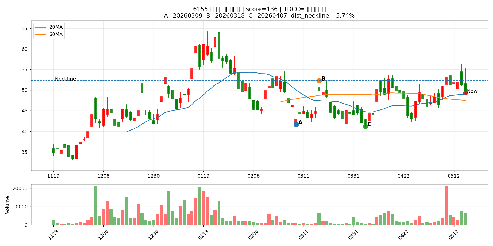

## 4927 泰鼎-KY

## 1305 華夏

## 6282 康舒

## 3701 大眾控

## 3041 揚智

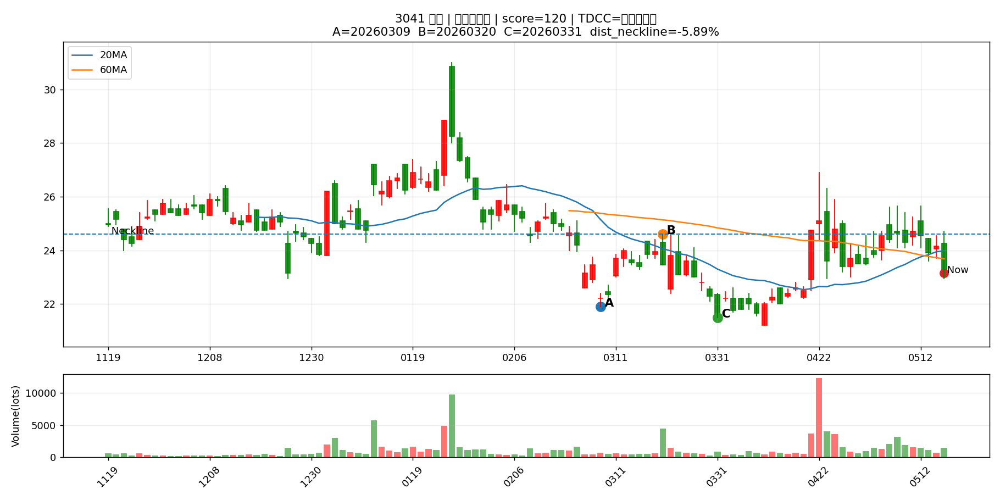

## 1905 華紙

## 6962 奕力-KY

## 8131 福懋科

## 2449 京元電子

## 6854 錼創科技-KY創

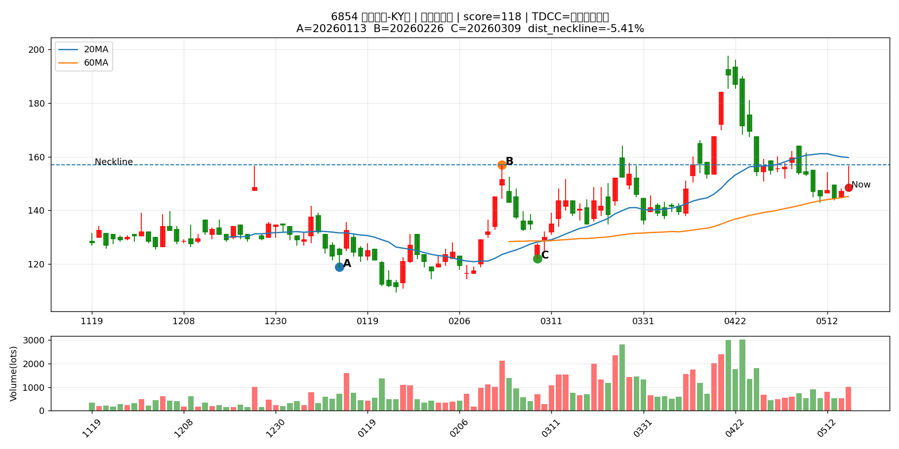

## 1313 聯成

## 2419 仲琦

## 6505 台塑化

## 3380 明泰

## 2605 新興

## 8033 雷虎

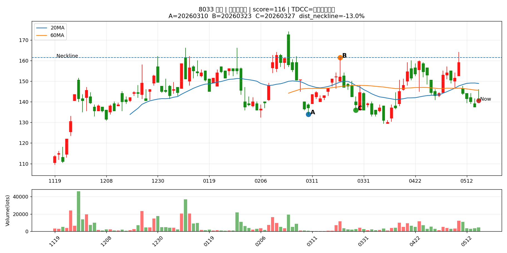

## 2241 艾姆勒

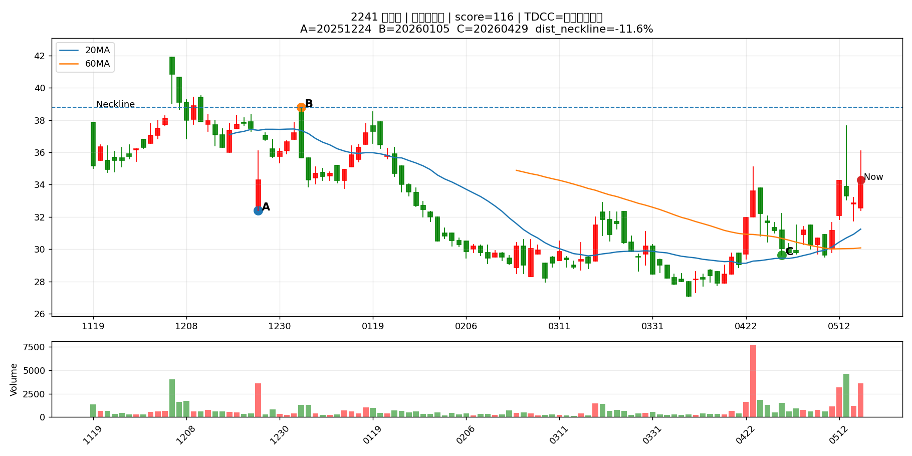

## 2329 華泰

## 6153 嘉聯益

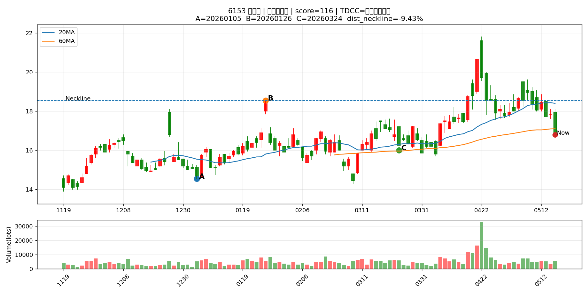

## 5484 慧友

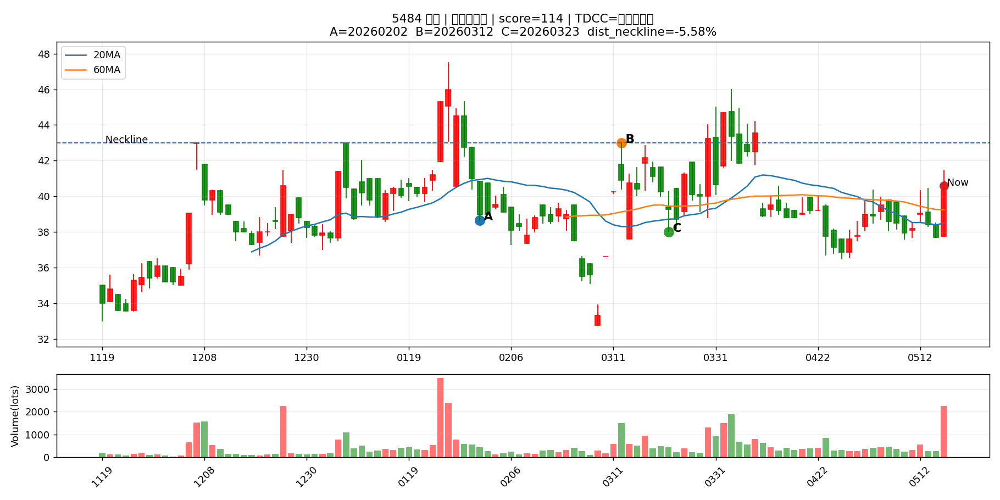

## 8104 錸寶

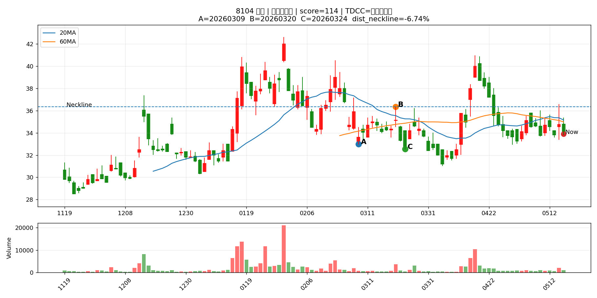

## 2501 國建

## 3013 晟銘電

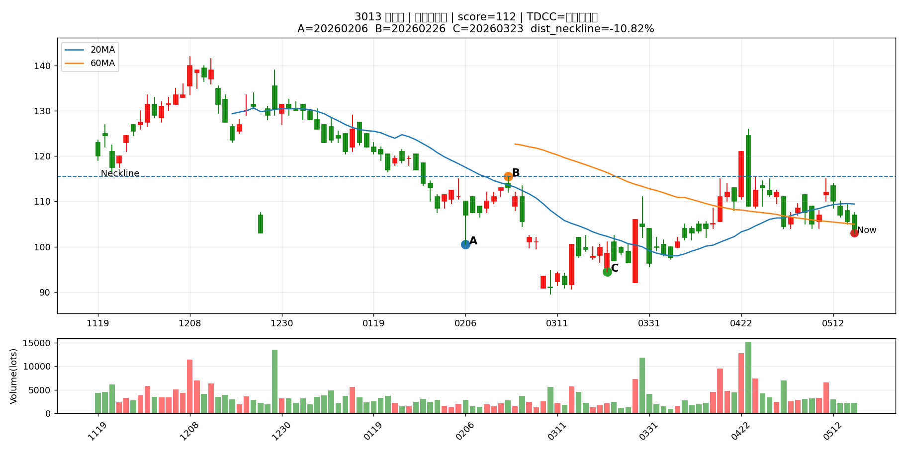

## 2009 第一銅

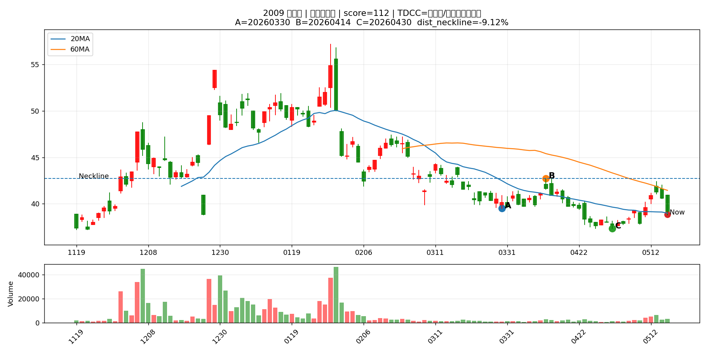

## 2324 仁寶

## 4746 台耀

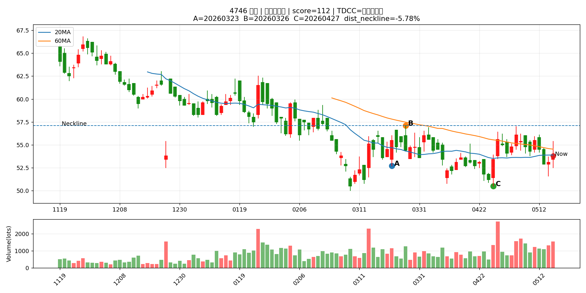

## 8222 寶一

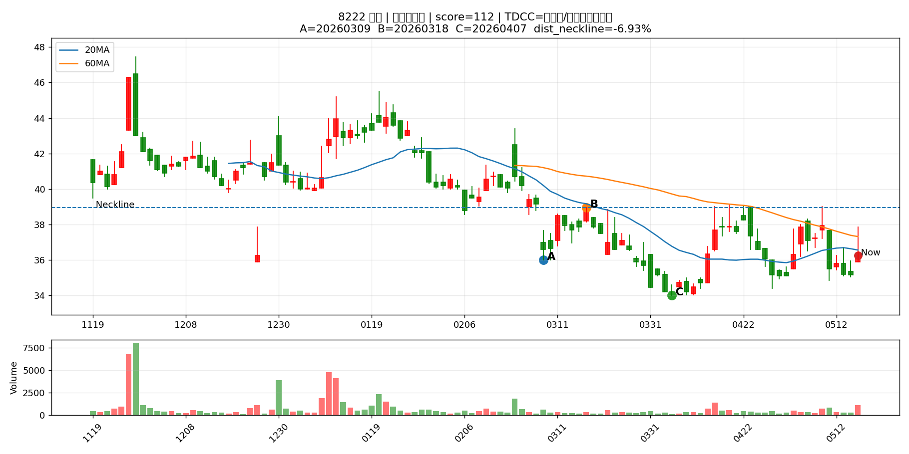

## 9105 泰金寶-DR

## 2455 全新

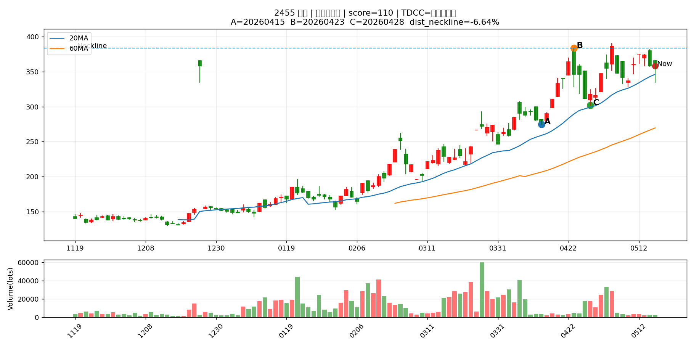
