# Pattern Chart Report

產生時間：2026-05-20 18:51:28
圖表數量：30

> 這份報告把 Pattern Scan 前 30 檔畫成 K 線圖，讓你用人眼篩掉不符合型態的股票。

> 圖中標示 A=第一低點、B=頸線、C=第二低點、Now=最新收盤。

## 總覽圖

---

## 圖表索引

|   代號 | 名稱     | 產業     | 型態階段   |   型態分數 |   距頸線% |   距第二底% |   二攻量/一攻量 | TDCC判斷      | 圖表                                    |
|-----:|:-------|:-------|:-------|-------:|-------:|--------:|----------:|:------------|:--------------------------------------|
| 4566 | 時碩工業   | 電機機械   | 預備發動型  |    130 |  -9.43 |    9.4  |      3.01 | 超大戶增加       | [查看圖](pattern_charts/4566_時碩工業.png)   |
| 1304 | 台聚     | 塑膠工業   | 預備發動型  |    130 |  -6.54 |   10.96 |      2.51 | 中大戶/超大戶同步增加 | [查看圖](pattern_charts/1304_台聚.png)     |
| 2337 | 旺宏     | 半導體業   | 預備發動型  |    130 | -12.96 |   19.49 |      2.35 | 大戶籌碼減少      | [查看圖](pattern_charts/2337_旺宏.png)     |
| 1305 | 華夏     | 塑膠工業   | 預備發動型  |    130 |  -6.39 |   10.67 |      2.2  | 中大戶/超大戶同步增加 | [查看圖](pattern_charts/1305_華夏.png)     |
| 6781 | AES-KY | 電子零組件業 | 預備發動型  |    130 |  -7.23 |   13.9  |      1.67 | 變化不明顯       | [查看圖](pattern_charts/6781_AES-KY.png) |
| 4927 | 泰鼎-KY  | 電子零組件業 | 預備發動型  |    130 | -11.34 |   16.34 |      1.44 | 大戶籌碼減少      | [查看圖](pattern_charts/4927_泰鼎-KY.png)  |
| 1904 | 正隆     | 造紙工業   | 預備發動型  |    126 |  -5.4  |    6.67 |      2.67 | 中大戶/超大戶同步增加 | [查看圖](pattern_charts/1904_正隆.png)     |
| 1447 | 力鵬     | 紡織纖維   | 預備發動型  |    126 |  -7.97 |   20.2  |      2.34 | 中大戶/超大戶同步增加 | [查看圖](pattern_charts/1447_力鵬.png)     |
| 1815 | 富喬     | 電子零組件業 | 預備發動型  |    124 | -14.96 |    4.74 |      3.45 | 大戶籌碼減少      | [查看圖](pattern_charts/1815_富喬.png)     |
| 6282 | 康舒     | 電子零組件業 | 預備發動型  |    124 |  -7.64 |   19.53 |      1.39 | 中大戶/超大戶同步增加 | [查看圖](pattern_charts/6282_康舒.png)     |
| 8131 | 福懋科    | 半導體業   | 預備發動型  |    120 |  -6.02 |    8.75 |      2.19 | 大戶籌碼減少      | [查看圖](pattern_charts/8131_福懋科.png)    |
| 1905 | 華紙     | 造紙工業   | 預備發動型  |    118 | -10.94 |    3.51 |      3.12 | 大戶籌碼減少      | [查看圖](pattern_charts/1905_華紙.png)     |
| 6962 | 奕力-KY  | 半導體業   | 預備發動型  |    118 |  -7.64 |   12.89 |      2.67 | 超大戶增加       | [查看圖](pattern_charts/6962_奕力-KY.png)  |
| 2354 | 鴻準     | 其他電子業  | 預備發動型  |    118 |  -5.27 |   11.65 |      2.32 | 大戶籌碼減少      | [查看圖](pattern_charts/2354_鴻準.png)     |
| 2392 | 正崴     | 電子零組件業 | 預備發動型  |    118 |  -6.81 |    7.55 |      1.87 | 大戶籌碼減少      | [查看圖](pattern_charts/2392_正崴.png)     |
| 3689 | 湧德     | 電子零組件業 | 預備發動型  |    118 |  -7.78 |   12.32 |      1.8  | 變化不明顯       | [查看圖](pattern_charts/3689_湧德.png)     |
| 1313 | 聯成     | 塑膠工業   | 預備發動型  |    116 | -11.02 |    5    |      2.49 | 中大戶/超大戶同步增加 | [查看圖](pattern_charts/1313_聯成.png)     |
| 2419 | 仲琦     | 通信網路業  | 預備發動型  |    116 |  -8.84 |    8.53 |      2.41 | 中大戶/超大戶同步增加 | [查看圖](pattern_charts/2419_仲琦.png)     |
| 8111 | 立碁     | 光電業    | 預備發動型  |    116 | -12.48 |    5.17 |      1.85 | 大戶籌碼減少      | [查看圖](pattern_charts/8111_立碁.png)     |
| 2413 | 環科     | 電子零組件業 | 預備發動型  |    116 |  -5.01 |   12.81 |      1.76 | 變化不明顯       | [查看圖](pattern_charts/2413_環科.png)     |
| 6412 | 群電     | 電子零組件業 | 預備發動型  |    116 |  -6.44 |   24.18 |      1.76 | 中大戶/超大戶同步增加 | [查看圖](pattern_charts/6412_群電.png)     |
| 2605 | 新興     | 航運業    | 預備發動型  |    116 |  -6.08 |    9.06 |      1.65 | 大戶籌碼減少      | [查看圖](pattern_charts/2605_新興.png)     |
| 6451 | 訊芯-KY  | 半導體業   | 預備發動型  |    114 | -12.68 |   14.78 |      1.84 | 中大戶/超大戶同步增加 | [查看圖](pattern_charts/6451_訊芯-KY.png)  |
| 6548 | 長科*    | 半導體業   | 預備發動型  |    114 |  -5.81 |    7.76 |      1.72 | 大戶籌碼減少      | [查看圖](pattern_charts/6548_長科*.png)    |
| 5498 | 凱崴     | 電子零組件業 | 預備發動型  |    114 | -11.67 |   18.11 |      1.18 | 大戶籌碼減少      | [查看圖](pattern_charts/5498_凱崴.png)     |
| 2501 | 國建     | 建材營造   | 預備發動型  |    112 |  -6.11 |    4.94 |      2.24 | 大戶籌碼減少      | [查看圖](pattern_charts/2501_國建.png)     |
| 9105 | 泰金寶-DR | 存託憑證   | 預備發動型  |    112 | -11.69 |    5.27 |      1.36 | 大戶籌碼減少      | [查看圖](pattern_charts/9105_泰金寶-DR.png) |
| 2449 | 京元電子   | 半導體業   | 預備發動型  |    110 |  -9.9  |    3.16 |      1.71 | 大戶籌碼減少      | [查看圖](pattern_charts/2449_京元電子.png)   |
| 3380 | 明泰     | 通信網路業  | 預備發動型  |    110 | -11.28 |    7.5  |      1.62 | 大戶籌碼減少      | [查看圖](pattern_charts/3380_明泰.png)     |
| 6505 | 台塑化    | 油電燃氣業  | 預備發動型  |    110 |  -6.23 |    5.79 |      1.53 | 中大戶/超大戶同步增加 | [查看圖](pattern_charts/6505_台塑化.png)    |

---

## 4566 時碩工業

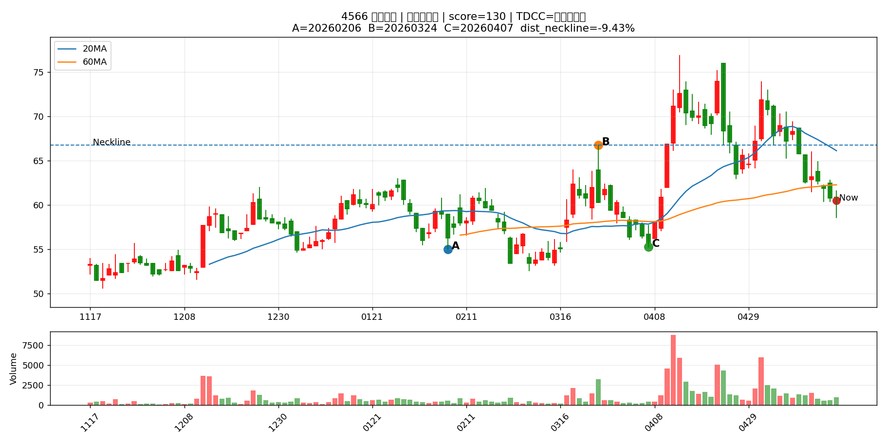

## 1304 台聚

## 2337 旺宏

## 1305 華夏

## 6781 AES-KY

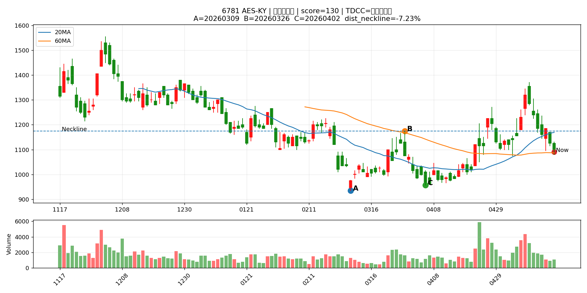

## 4927 泰鼎-KY

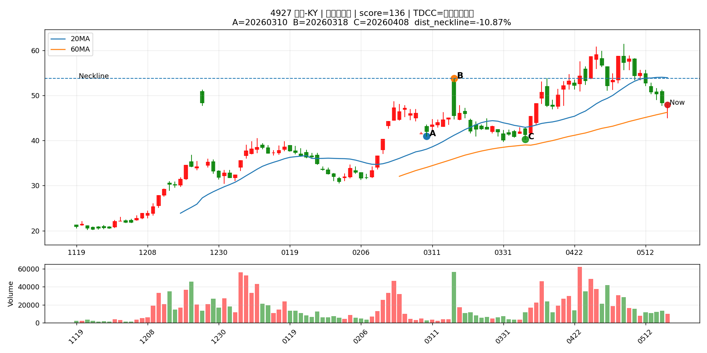

## 1904 正隆

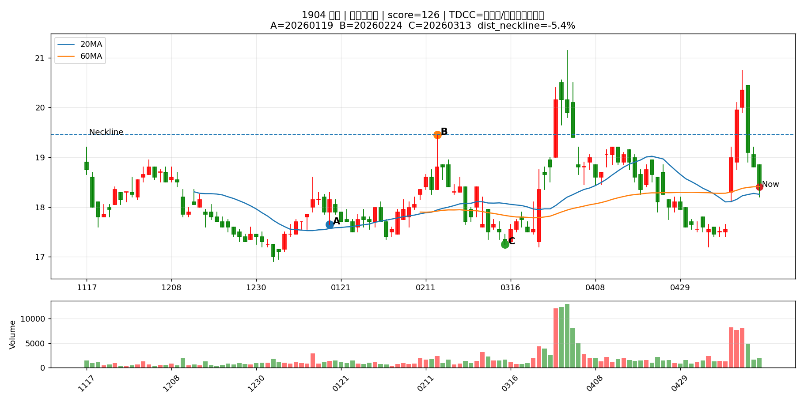

## 1447 力鵬

## 1815 富喬

## 6282 康舒

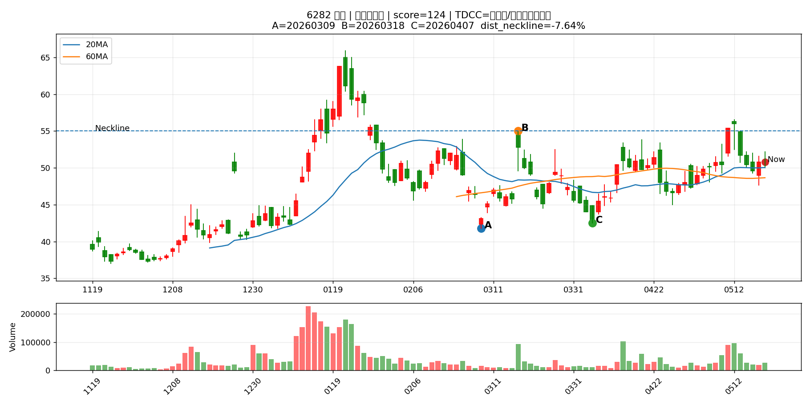

## 8131 福懋科

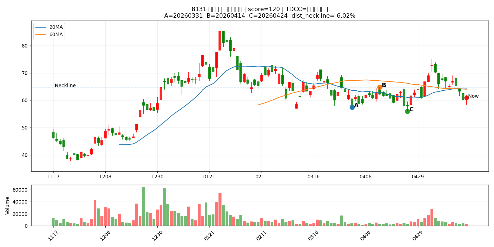

## 1905 華紙

## 6962 奕力-KY

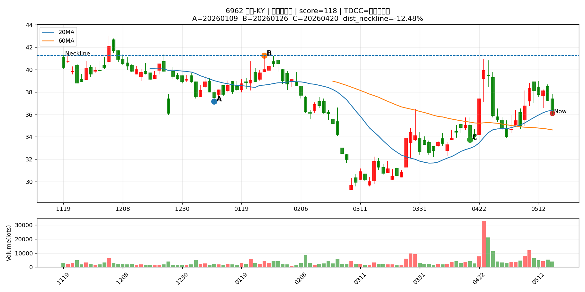

## 2354 鴻準

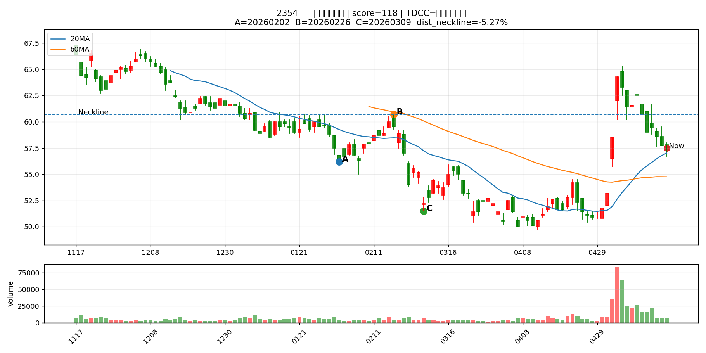

## 2392 正崴

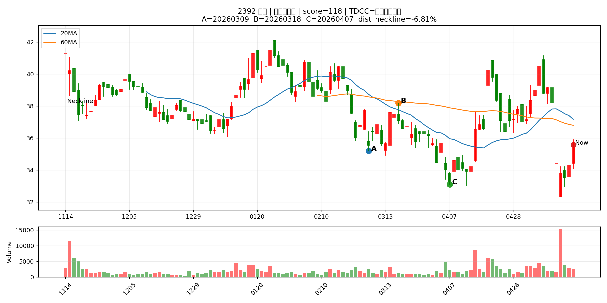

## 3689 湧德

## 1313 聯成

## 2419 仲琦

## 8111 立碁

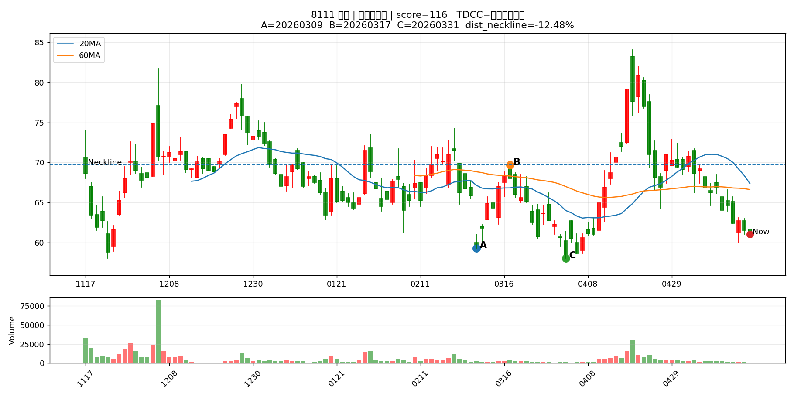

## 2413 環科

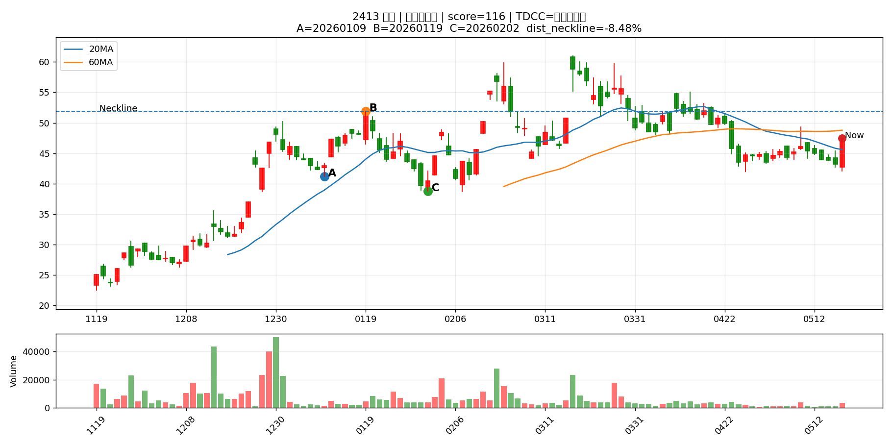

## 6412 群電

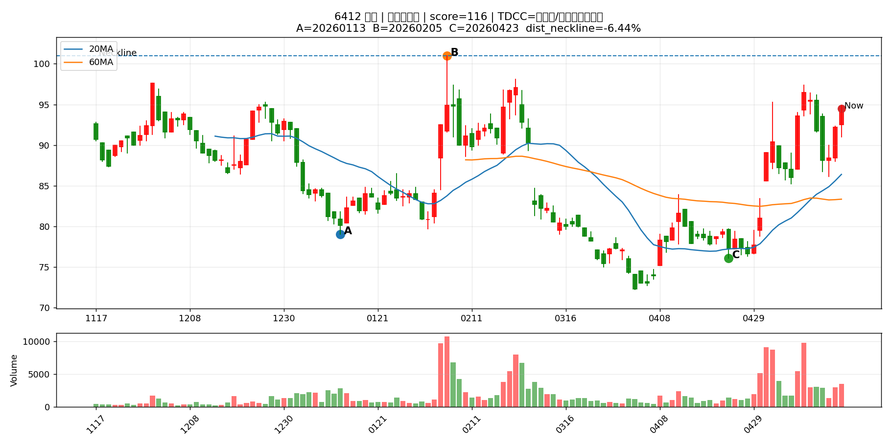

## 2605 新興

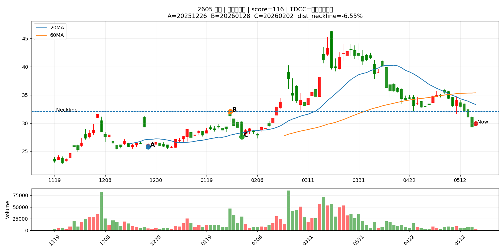

## 6451 訊芯-KY

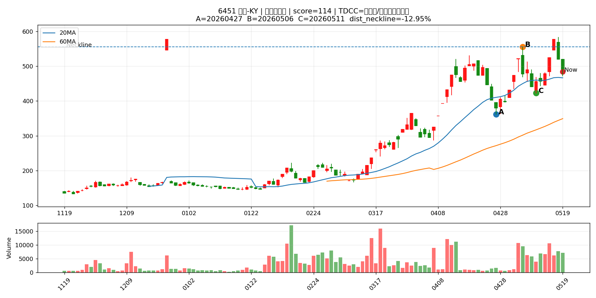

## 6548 長科*

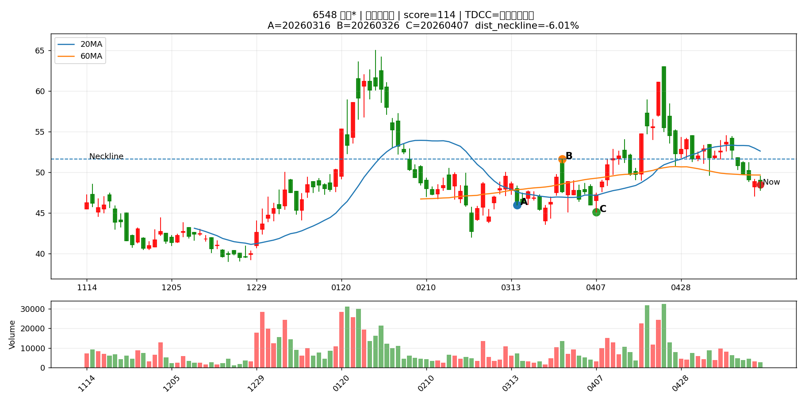

## 5498 凱崴

## 2501 國建

## 9105 泰金寶-DR

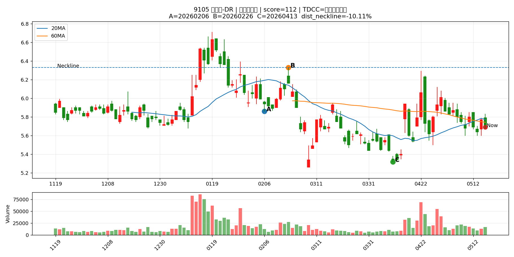

## 2449 京元電子

## 3380 明泰

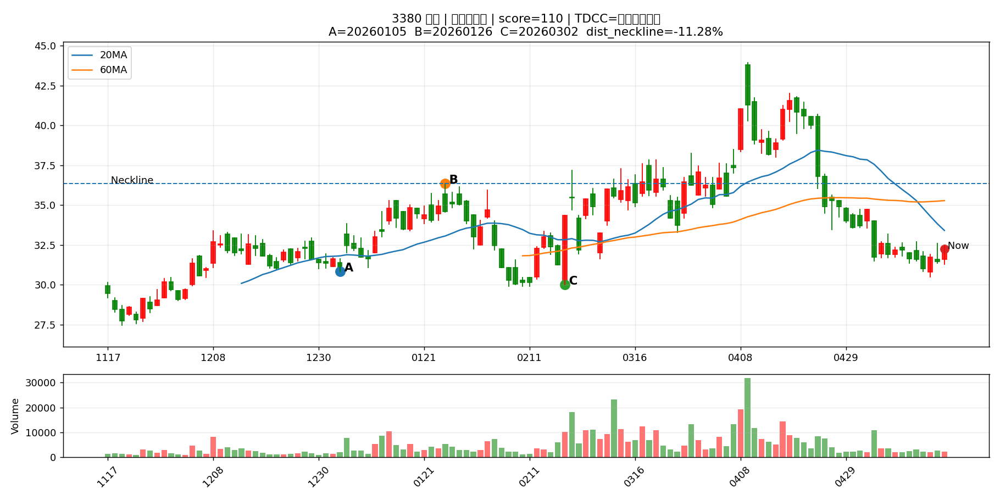

## 6505 台塑化

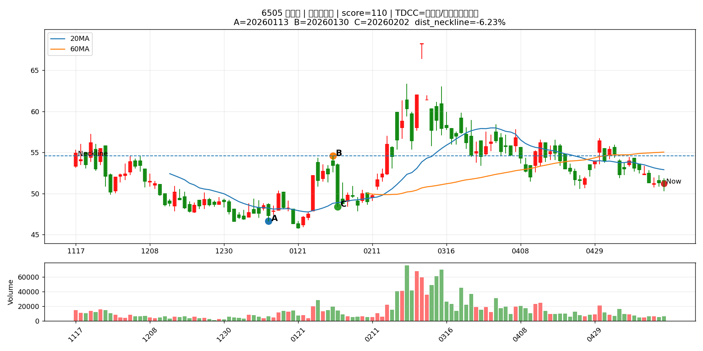
