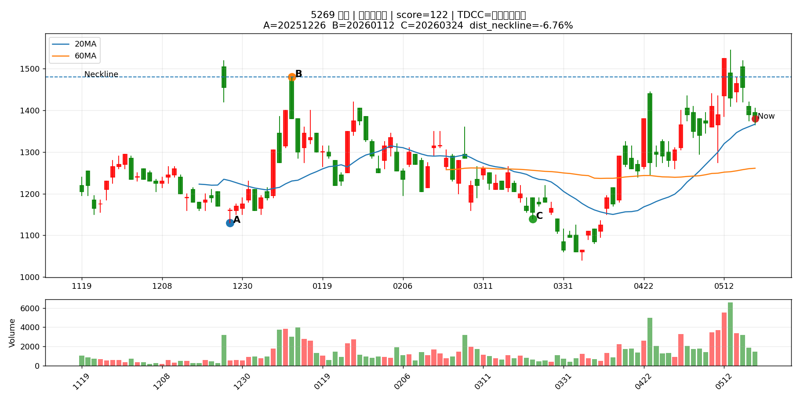
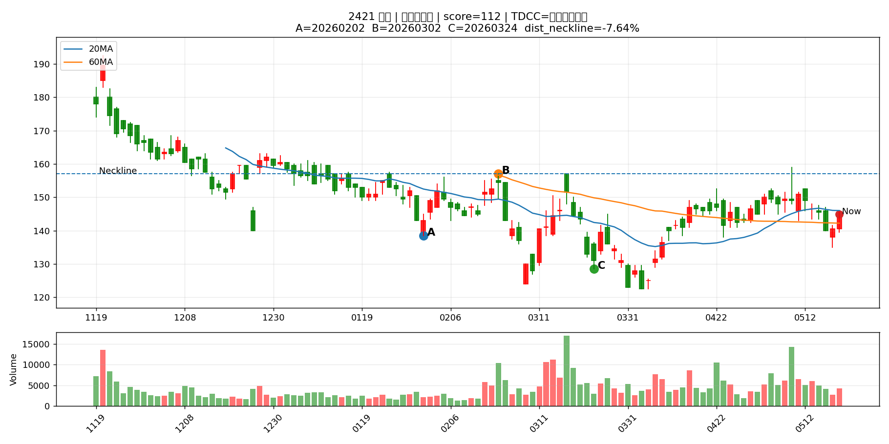
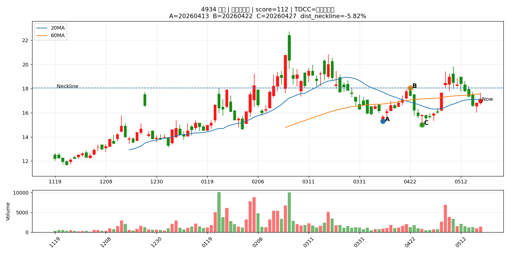
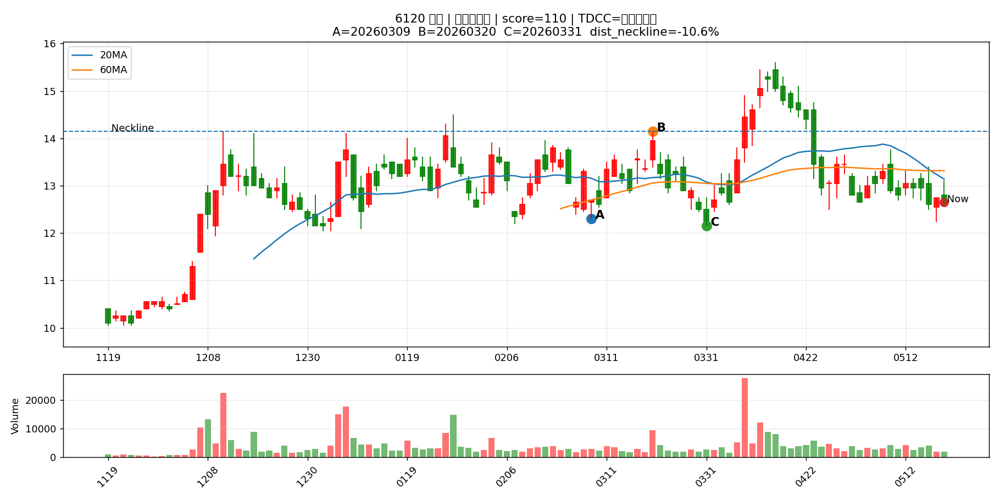

# Pattern Chart Report

產生時間：2026-05-19 11:52:43
圖表數量：30

> 這份報告把 Pattern Scan 前 30 檔畫成 K 線圖，讓你用人眼篩掉不符合型態的股票。

> 圖中標示 A=第一低點、B=頸線、C=第二低點、Now=最新收盤。

## 總覽圖

---

## 圖表索引

|   代號 | 名稱     | 產業       | 型態階段   |   型態分數 |   距頸線% |   距第二底% |   二攻量/一攻量 | TDCC判斷      | 圖表                                    |
|-----:|:-------|:---------|:-------|-------:|-------:|--------:|----------:|:------------|:--------------------------------------|
| 4927 | 泰鼎-KY  | 電子零組件業   | 預備發動型  |    136 |  -7.25 |   23.98 |      1.92 | 大戶籌碼減少      | [查看圖](pattern_charts/4927_泰鼎-KY.png)  |
| 2485 | 兆赫     | 通信網路業    | 預備發動型  |    130 | -14.12 |    5.69 |      2.96 | 中大戶/超大戶同步增加 | [查看圖](pattern_charts/2485_兆赫.png)     |
| 2419 | 仲琦     | 通信網路業    | 預備發動型  |    130 | -11.99 |    5.24 |      2.81 | 中大戶/超大戶同步增加 | [查看圖](pattern_charts/2419_仲琦.png)     |
| 2337 | 旺宏     | 半導體業     | 預備發動型  |    130 | -11.11 |   22.03 |      2.8  | 大戶籌碼減少      | [查看圖](pattern_charts/2337_旺宏.png)     |
| 1304 | 台聚     | 塑膠工業     | 預備發動型  |    130 |  -5.08 |   10.96 |      2.74 | 中大戶/超大戶同步增加 | [查看圖](pattern_charts/1304_台聚.png)     |
| 1305 | 華夏     | 塑膠工業     | 預備發動型  |    130 |  -6.02 |   11.11 |      2.26 | 中大戶/超大戶同步增加 | [查看圖](pattern_charts/1305_華夏.png)     |
| 2344 | 華邦電    | 半導體業     | 預備發動型  |    130 | -13.6  |   23.68 |      2.25 | 中大戶/超大戶同步增加 | [查看圖](pattern_charts/2344_華邦電.png)    |
| 6282 | 康舒     | 電子零組件業   | 預備發動型  |    124 |  -7.64 |   19.53 |      1.47 | 中大戶/超大戶同步增加 | [查看圖](pattern_charts/6282_康舒.png)     |
| 3701 | 大眾控    | 電腦及週邊設備業 | 預備發動型  |    122 | -12.48 |    7.25 |      2.14 | 大戶籌碼減少      | [查看圖](pattern_charts/3701_大眾控.png)    |
| 6215 | 和椿     | 其他電子業    | 預備發動型  |    122 |  -5    |   24.87 |      1.36 | 中大戶/超大戶同步增加 | [查看圖](pattern_charts/6215_和椿.png)     |
| 5269 | 祥碩     | 半導體業     | 預備發動型  |    122 |  -6.76 |   21.05 |      1.18 | 大戶籌碼減少      | [查看圖](pattern_charts/5269_祥碩.png)     |
| 1447 | 力鵬     | 紡織纖維     | 預備發動型  |    122 |  -9.38 |    8.61 |      1.16 | 中大戶/超大戶同步增加 | [查看圖](pattern_charts/1447_力鵬.png)     |
| 1905 | 華紙     | 造紙工業     | 預備發動型  |    118 | -10.57 |    3.04 |      2.98 | 大戶籌碼減少      | [查看圖](pattern_charts/1905_華紙.png)     |
| 1504 | 東元     | 電機機械     | 預備發動型  |    118 |  -5.96 |   13.36 |      2.66 | 大戶籌碼減少      | [查看圖](pattern_charts/1504_東元.png)     |
| 2449 | 京元電子   | 半導體業     | 預備發動型  |    118 | -11.89 |   13.11 |      1.55 | 大戶籌碼減少      | [查看圖](pattern_charts/2449_京元電子.png)   |
| 1313 | 聯成     | 塑膠工業     | 預備發動型  |    116 | -11.02 |    5    |      2.66 | 中大戶/超大戶同步增加 | [查看圖](pattern_charts/1313_聯成.png)     |
| 6505 | 台塑化    | 油電燃氣業    | 預備發動型  |    116 |  -6.04 |    5.99 |      2.01 | 中大戶/超大戶同步增加 | [查看圖](pattern_charts/6505_台塑化.png)    |
| 3380 | 明泰     | 通信網路業    | 預備發動型  |    116 | -13.48 |    4.83 |      1.95 | 大戶籌碼減少      | [查看圖](pattern_charts/3380_明泰.png)     |
| 2605 | 新興     | 航運業      | 預備發動型  |    116 |  -5.46 |    9.78 |      1.85 | 大戶籌碼減少      | [查看圖](pattern_charts/2605_新興.png)     |
| 2359 | 所羅門    | 其他電子業    | 預備發動型  |    116 |  -9.4  |   14.41 |      1.49 | 大戶籌碼減少      | [查看圖](pattern_charts/2359_所羅門.png)    |
| 6451 | 訊芯-KY  | 半導體業     | 預備發動型  |    114 | -12.95 |   14.42 |      1.93 | 中大戶/超大戶同步增加 | [查看圖](pattern_charts/6451_訊芯-KY.png)  |
| 6962 | 奕力-KY  | 半導體業     | 預備發動型  |    112 | -12.85 |    6.52 |      2.72 | 超大戶增加       | [查看圖](pattern_charts/6962_奕力-KY.png)  |
| 8131 | 福懋科    | 半導體業     | 預備發動型  |    112 |  -7.1  |    7.5  |      2.25 | 大戶籌碼減少      | [查看圖](pattern_charts/8131_福懋科.png)    |
| 2501 | 國建     | 建材營造     | 預備發動型  |    112 |  -6.53 |    4.47 |      2.24 | 大戶籌碼減少      | [查看圖](pattern_charts/2501_國建.png)     |
| 1536 | 和大     | 汽車工業     | 預備發動型  |    112 |  -5.48 |    3.41 |      1.97 | 中大戶增加       | [查看圖](pattern_charts/1536_和大.png)     |
| 2421 | 建準     | 電子零組件業   | 預備發動型  |    112 |  -7.64 |   12.84 |      1.57 | 大戶籌碼減少      | [查看圖](pattern_charts/2421_建準.png)     |
| 4934 | 太極     | 光電業      | 預備發動型  |    112 |  -5.82 |   13.33 |      1.38 | 中大戶增加       | [查看圖](pattern_charts/4934_太極.png)     |
| 9105 | 泰金寶-DR | 存託憑證     | 預備發動型  |    112 | -11.85 |    4.89 |      1.36 | 大戶籌碼減少      | [查看圖](pattern_charts/9105_泰金寶-DR.png) |
| 6191 | 精成科    | 電子零組件業   | 預備發動型  |    110 |  -9.46 |    5.33 |      1.6  | 大戶籌碼減少      | [查看圖](pattern_charts/6191_精成科.png)    |
| 6120 | 達運     | 光電業      | 預備發動型  |    110 | -10.6  |    4.12 |      1.4  | 超大戶增加       | [查看圖](pattern_charts/6120_達運.png)     |

---

## 4927 泰鼎-KY

## 2485 兆赫

## 2419 仲琦

## 2337 旺宏

## 1304 台聚

## 1305 華夏

## 2344 華邦電

## 6282 康舒

## 3701 大眾控

## 6215 和椿

## 5269 祥碩

## 1447 力鵬

## 1905 華紙

## 1504 東元

## 2449 京元電子

## 1313 聯成

## 6505 台塑化

## 3380 明泰

## 2605 新興

## 2359 所羅門

## 6451 訊芯-KY

## 6962 奕力-KY

## 8131 福懋科

## 2501 國建

## 1536 和大

## 2421 建準

## 4934 太極

## 9105 泰金寶-DR

## 6191 精成科

## 6120 達運

